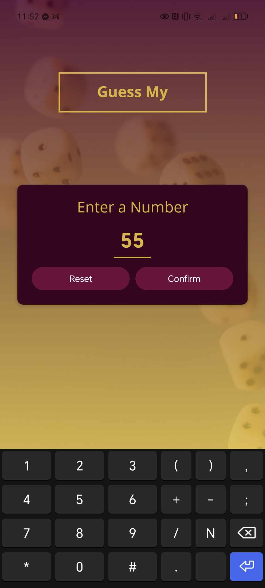
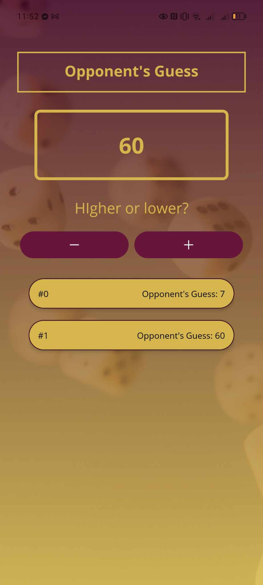
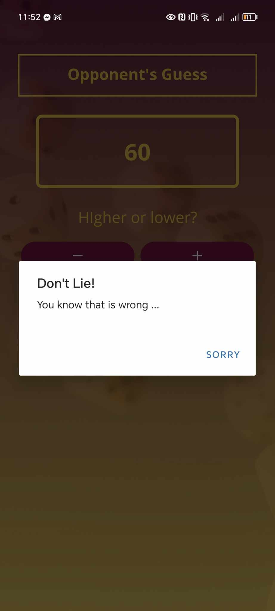
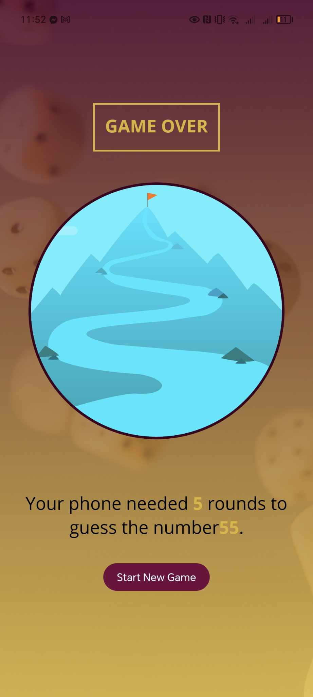

<h1 align="center">
  Mini Game App
  <br>
</h1>

<p align="center">
  <a href="#key-features">Key Features</a> •
  <a href="#how-to-use">How To Use</a> •
  <a href="#credits">Credits</a> •
  <a href="#you-may-also-like">You may also like</a> 
</p>

<p align="center">
  
  
  
  

</p>

## Key Features

- use Input his/her Number

- Computer Gues your number

  - it use binary search like functional for it

- display some feedback

## How To Use

To clone and run this application, you'll need [Git](https://git-scm.com) and [Node.js](https://nodejs.org/en/download/) (which comes with [npm](http://npmjs.com)) installed on your computer. From your command line:

```bash
# Clone this repository
$ git clone https://github.com/Amiko1/goal-app.git

# Go into the repository
$ cd goal-app

# Install dependencies
$ npm install

# Run the app
$ npm start

#scan it with iphone or android

```

## Credits

This software uses the following open source packages:

- [Node.js](https://nodejs.org/)
- [Expo](https://expo.dev/)
- [react Native](https://reactnative.dev/)

> GitHub [@Amiko1](https://github.com/Amiko1) &nbsp;&middot;&nbsp;
> Linkedin [@amiran burjanadze](https://www.linkedin.com/in/amiran-burjanadze-a301111b7/)

## You may also like

- [goal-app](https://github.com/Amiko1/goal-app)
